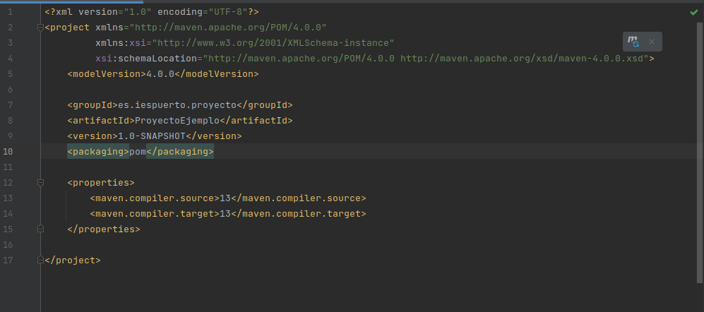
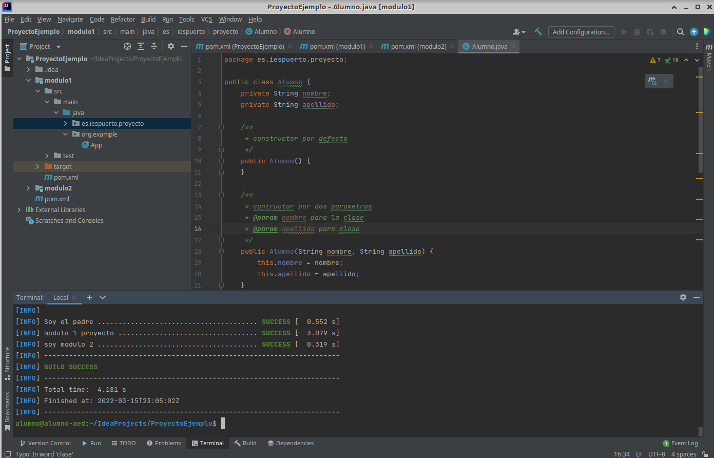
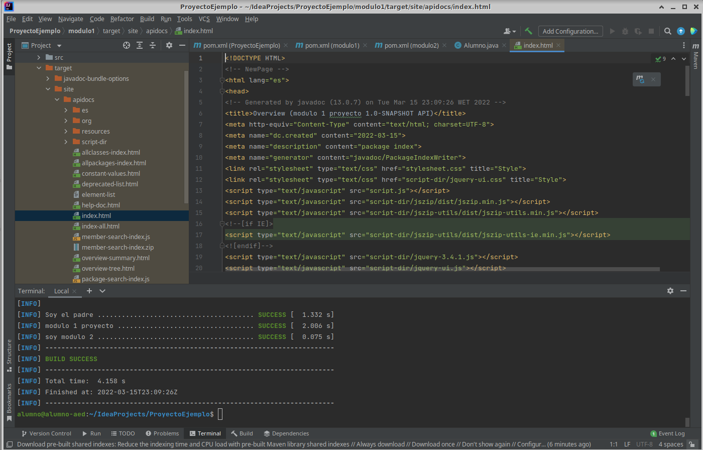

*Alfonso García Jorge*

# Proyecto Multimodulo

## Debemos de tener Maven y Java(Home)

### Primeros Pasos

Creamos el proyecto donde elegimos maven, y le damos a continuar. Ponemos el titulo correspondiente al proyecto.

A continuación, vamos a terminal y ejecutamos "mvn clean package"

Ahora debemos cambiar en el pom padre unas cosas:
En gropupID debemos poner es(idioma).empresa.nombreproyecto
Ejemplo: es.iespuerto.buscador
Y también debemos añadir el packaging que pondremos pom.

Ejecutamos "mvn clean package" y borramos la carpeta src, y volvemos a ejecutar "mvn clean package"

### Crear modulos

Haremos click derecho encima del proyecto (le daremos a create from ... y seleccionamos la que termina en quickstar)

Le ponemos su nombre, y le damos siguiente y finish.

El IDE debe generarte las propiedad dependecias y build. Te debe crear algo asi pero en el modulo que creastes:

Cortamos desde propiedades hasta que termine build. Y lo pegamos en el pom de padre como aparece en la anterior captura quitando las propiedades del padre.

Tambien debemos añadir en el pom padre:
name (modulo padre)
Y web dentro de propiedades donde pegamos nuestra url
Fuera debajo de name pondremo url ${web} como se ve en la captura.

Podremos crear los modulos hijos que queramos solo debemos eliminar las propiedades y añadir el name y la url tambien la añadiremos a los modulos hijos.
Finalmente haremos un mvn clean package, aunque es recomendable despues de cualquier cambio ejecutarlo para saber si todo sigue correctamente.
### Crear clases

Creamos primero dentro de un modulo nunca dentro del padre (new package) donde pondremos es.iespuerto.nombredelproyecto.

Creado el paquete, encima de el click derecho y creamos una class.

Dentro de la class pues haremos lo que debamos hacer, en nuestro caso creamos propiedades de la clase y con ellos los getter y setter y los constructores correspondientes.A lo cual añadiremos la respectiva documentación.

Para comentar cualquier cosa, en la linea encima de metodo o clase pondremo /** y enter. Se abrirá la documentación.
Todo comentado en terminal pondremos en este caso "mvn clean javadoc:javadoc"

### Finalmente

Cuando ejecutemos en terminal el anterior comando nos genera la documentación y si esta todo correcto nos debería aparecer dentro de target-site-index.html 
nos aparecerá asi:

Si lo abrimos en un buscador web nos abrirá la documentación correspondiente en html.

#### Eso sería mas o menos todo lo basico para crear un proyecto multimodulo

